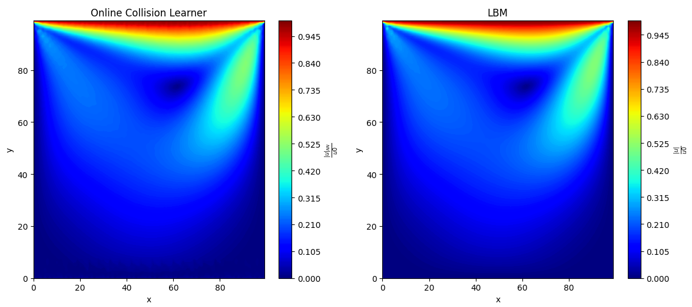

# Physics-Informed Real-Time LBM Collision Operator Learner

[](LICENSE)
[](https://www.python.org/)

An adaptive, physics-informed framework integrating online learning into the Lattice Boltzmann Method (LBM). Leveraging a deep neural network, this hybrid solver learns the collision operator in real time, blending data-driven flexibility with the rigor of the discrete Boltzmann equation.

## 🚀 Features

- **Adaptive Accuracy:** Learns deviations from the BGK collision operator in complex flow regions.
- **Online Training:** No precomputed dataset—updates the neural collision learner at runtime.
- **Physics Constraints:** Enforces advection and collision dynamics via a custom loss function.
- **D2Q9 on GPU:** 100×100 grid with moving-lid boundary conditions for shear-driven flow.


## 🔧 Installation

   ```
   git clone this is git repository:
   https://github.com/AlirezaSamari/Physics-Informed-Real-Time-LBM-Collision-Operator-Learner.git
   cd Physics-Informed-Real-Time-LBM-Collision-Operator-Learner
   ```


## ⚙️ Implementation Details

- **Domain & Lattice:** D2Q9 on a 100×100 grid with bounce-back walls (left, right, bottom) and a moving lid on the top.
- **Network Architecture:** `AdaptiveResNet` with:
  - Residual blocks featuring learnable activation (`tanh(αx)`) and skip-weight (`β`).
  - Final linear projection to 9 velocity directions.
- **Physics-Informed Loss:**  
  - **Collision MSE:** Difference between NN‑predicted post-collision and analytic BGK reference.  
  - **Advection Residual:** Finite-difference of streaming operator.

## 🔄 Training Loop

```python
for t in range(maxIter):
    rho, u = macroscopic(fin)                    # compute density & velocity
    feq = equilibrium(rho, u)                    # analytic equilibrium
    fout = fin - (fin - feq) / tau               # BGK reference
    fin = stream_and_bounce(fout)                # streaming + bounce-back

    if t % train_interval == 0:
        # Physics-informed update
        loss = boltzmann_loss(
            model(fin_prev), fin - step, feq, v, tau
        ) + MSE(model(fin_prev), fout)
        loss.backward()
        optimizer.step()
        scheduler.step()

    if t % 1000 == 0:
        visualize_velocity(u, model_predict)
```

## 📈 Results



Compare the neural collision learner’s velocity magnitude (left) against the standard LBM (right).

## 🤝 Contributing

Contributions are welcome! Please:
1. Fork the repo
2. Create a feature branch (`git checkout -b feature/YourFeature`)
3. Commit your changes (`git commit -m 'Add some feature'`)
4. Push to branch (`git push origin feature/YourFeature`)
5. Open a Pull Request

## 📄 License

This project is licensed under the MIT License — see the [LICENSE](LICENSE) file for details.

---

**Author:** Alireza Samari

*Questions? Feel free to contact me via E-mail (alirexasamari@gmail.com).*

